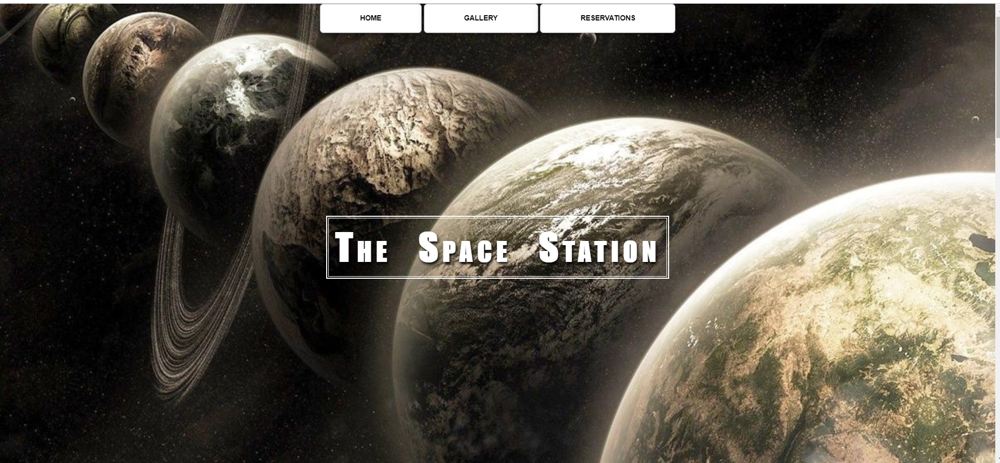
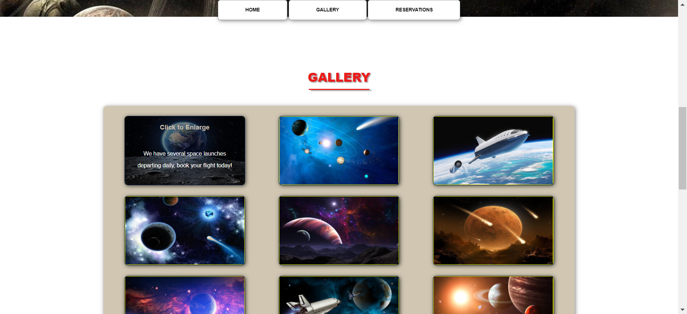
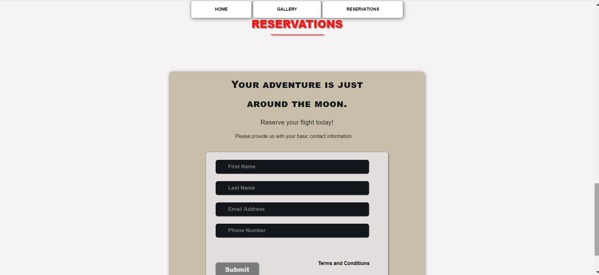

# Projects
This is one of my school projects that I created by using HTML, CSS, and VS Code to write and edit code. The website was created to allow individuals to book space travel flights to outer space. It contains pictures and has a simple form to book flights. A simple neat website with only HTML, CSS, and VS Code.

Here are some screen shots of the project:

